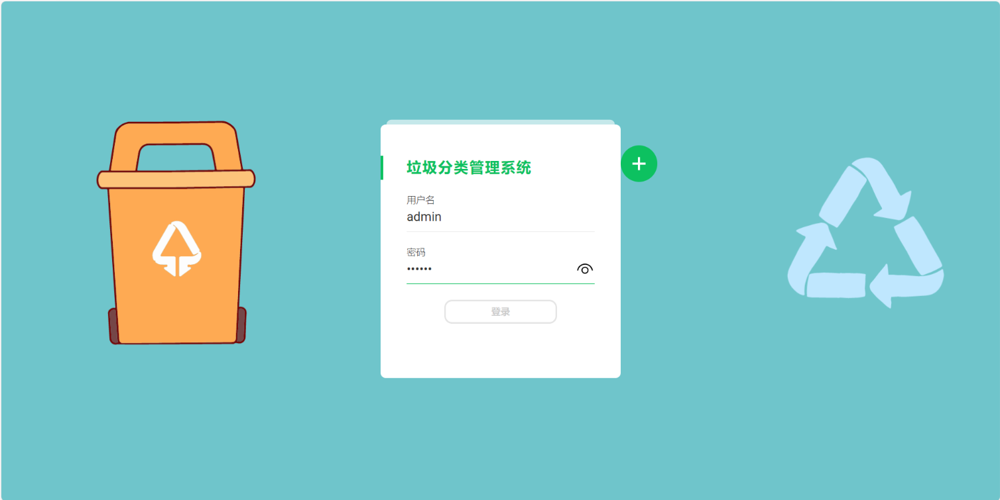
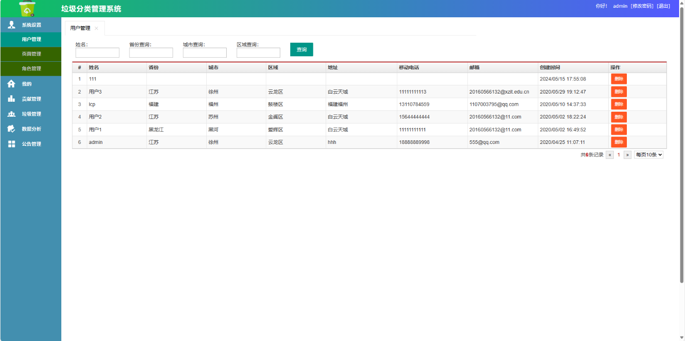
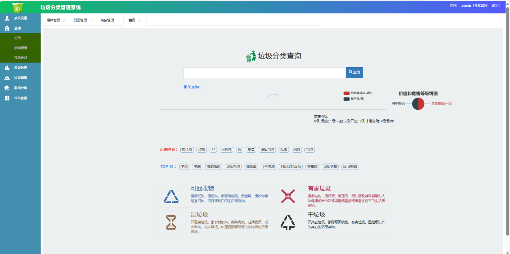
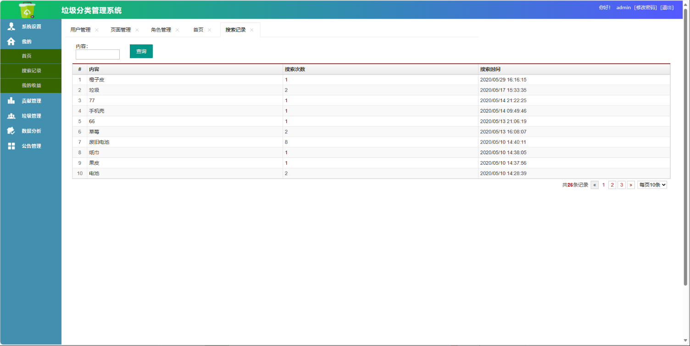
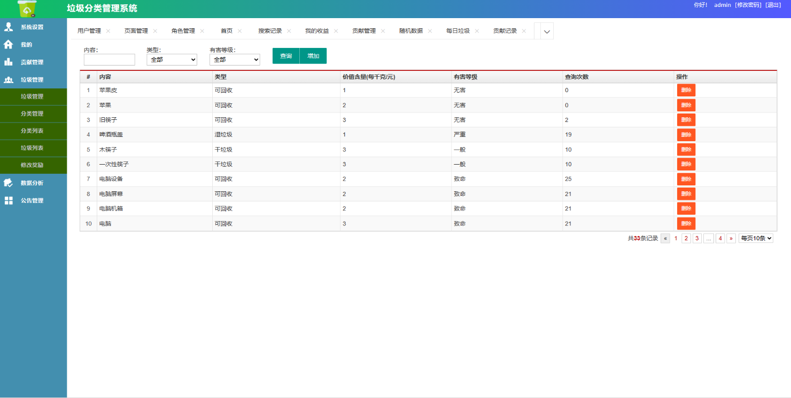
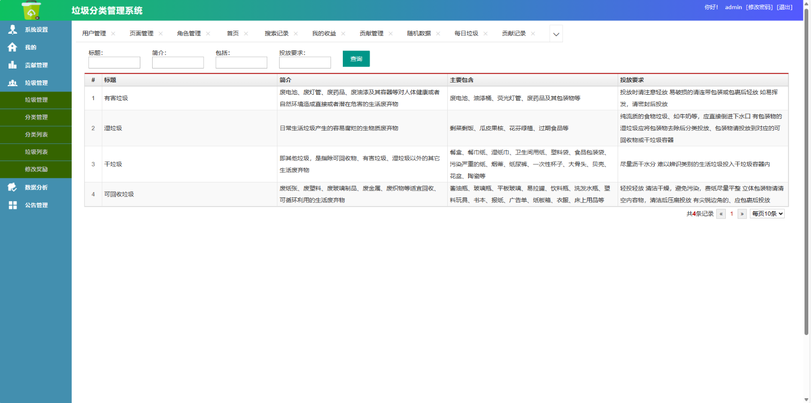
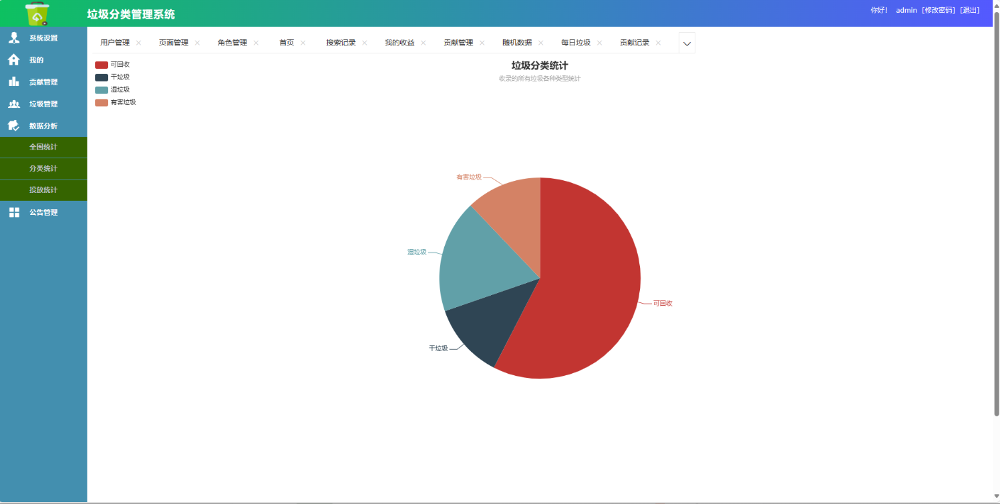

# 垃圾分类管理系统

### 9.9￥ 获取完整源码+sql，需要加Q：3577148218 ,备用Q: 3808981644
### 有问题，或者需要协助调试运行项目的也可联系
### 获取更多项目，关注公众号：编程项目集

## 一、项目介绍

### 基于sprignboot的垃圾分离管理系统

前端技术：HTML、CSS、JS、Jquery、Bootstrap

后端技术：SpringBoot、Mybatis

数据库 ：MySQL

系统角色：管理员、用户

登录、注册功能
垃圾管理：垃圾管理、分类管理、垃圾列表
数据分析：全国统计、分类统计、投放统计，采用饼图、地图
贡献管理：贡献记录、每日垃圾的记录
系统设置：用户设置、页面管理、角色管理
公告管理：公告管理、公告列表、发布公告

## 三、系统运行界面展示

### 9.9￥ 获取完整源码+sql，需要加Q：3577148218 ,备用Q: 3808981644
### 有问题，或者需要协助调试运行项目的也可联系
### 获取更多项目，关注公众号：编程项目集

